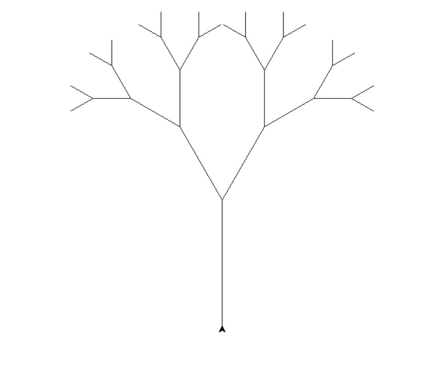
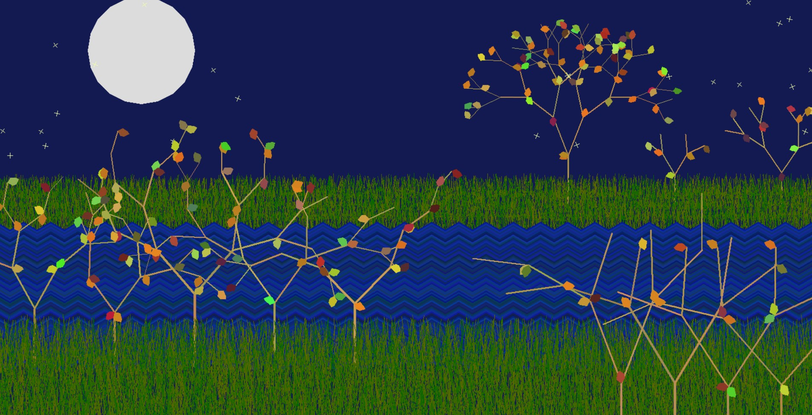

# Recursive Functions

By definition, a recursive function is one that calls itself within itself, over and over again. Naturally, this could go on forever, unless a certain, pre-set condition is met. To understand the concept of recursive functions, take a look at the code below:

python
def count_down(n) :
    print(n)
    count_down(n - 1)

As you can see, this function is supposed to count down from number n to number 0; but without asserting a certain stopping condition, this program will continue this recursion non-stop. To avoid this infinite loop, we add a condition, so that the function only works when n is greater than, or equal to zero.

python
def count_down(n) :
    if n >= 0 :
    print(n)
    count_down(n - 1)

# Branches: An Example of Recursion

We have all seen trees; they have branches, and those branches have sub-branches. When you think about it, it sounds a lot like recursion. 

From a recursive perspective, a tree is a straight line which at a certain point goes into two differnt directions. The same thing happens with each of these two lines; leaving us with four branches. Granting that we continue to draw these branches, the result resembles a tree.

Here's a simple code :

python
import turtle

turtle.setheading(90)
turtle.penup()
turtle.setpos(0, -200)
turtle.pendown()

def tree(l) :
    if l > 30 :
            turtle.forward(l)
            turtle.left(30)
            tree(0.67 * l)
            turtle.right(2 * 30)
            tree(0.67 * l)
            turtle.left(30)
            turtle.backward(l)

tree(200)
turtle.mainloop()

# Let's Add Some Glamour...

The code above leaves you with a symmetrical, socially-anxious tree. We don't want that, now do we? 

We can make new turtles, add leaves, color, and shapes. I randomised a lot of the process, so that it'd look more natural. I made it so that each leave is drawn with a fifty-fifty chance, and that the angle in which our turtle tilts is chosen randomly for each individual tree. With a few more adjustments, and a lot of dirty, unhygienic coding, I got to this :

